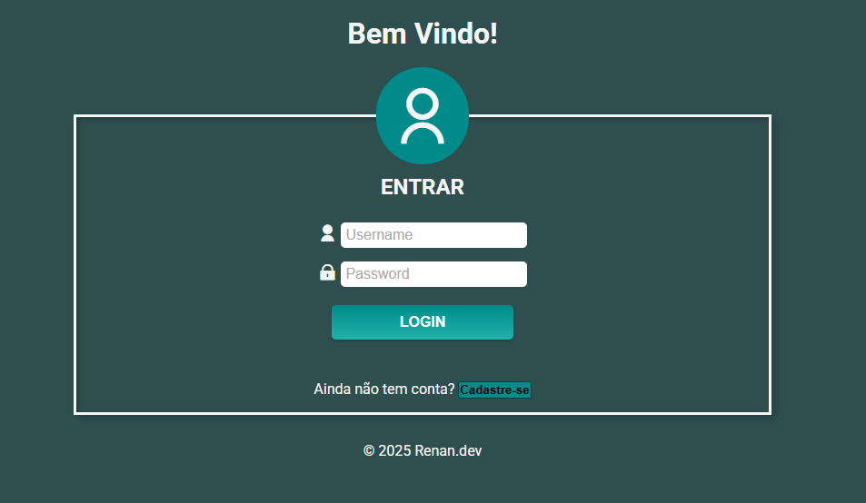
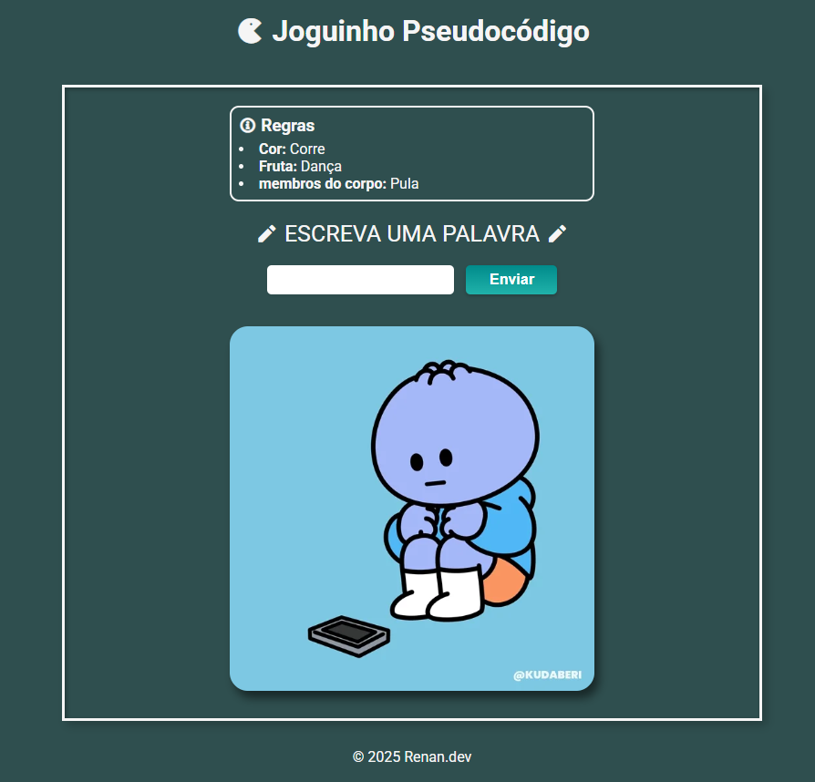

# 🔐 Sistema de Login + 🎮 Jogo Interativo

Este projeto combina um **sistema de Login e Cadastro** com um **jogo interativo em JavaScript**.  
Após se cadastrar e realizar login, o usuário é redirecionado para o jogo.

## 🚀 Funcionalidades
- Tela de **Login** e **Cadastro** com troca dinâmica
- Validação de campos obrigatórios
- Cadastro de usuários armazenados em memória (`array`)
- Login com verificação de usuário e senha
- Redirecionamento para um jogo ao logar com sucesso

## 🎮 O Jogo
O jogo recebe uma palavra e, dependendo da categoria, o personagem realiza uma ação:
- **Cor** → Corre 🏃‍♂️  
- **Fruta** → Dança 💃  
- **Membro do corpo** → Pula 🤸  
- **Desconhecido** → Reação surpresa 🤔  

## 🛠️ Tecnologias
- **HTML5**
- **CSS3**
- **JavaScript (Vanilla JS)**
- **Remix Icon**
- **Giphy Embeds**

## 📷 Demonstração
  
  

## 📌 Autor
👤 **Renan.dev**  
📎 [LinkedIn](https://www.linkedin.com/in/renan-andrade-dev/)  
📎 [GitHub](https://github.com/nanzim2)  
